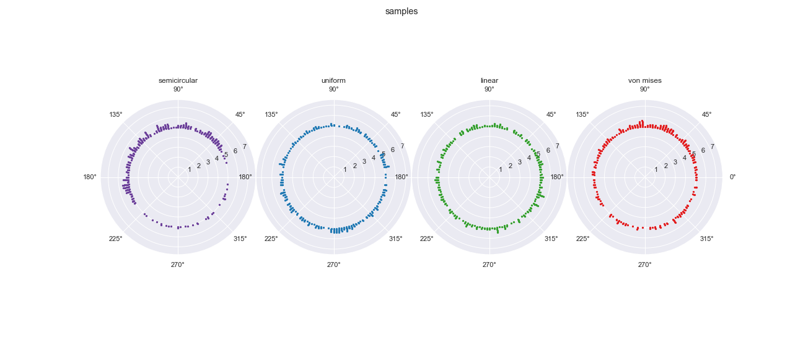
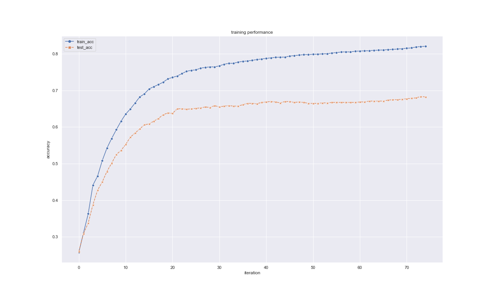

# Modeling Periodic Densities 



Fouriernets uses tooling from [Autograd](https://github.com/HIPS/autograd) to implement parametric models over periodic generating densities. I intend to show examples using multilayer perceptrons, autoencoders, and variational autoencoders (currently a tutorial for generating a simple mlp is available). 

## Contents 
  1. [Installing Dependencies]() 
  2. [Background]() 
  3. [Example]() 
  4. [References]()

---
## Installing Dependences 

### Configuring Your Path 

The modules under `src` must be visible to your Python3 interpreter to be imported. You can do this by updating your shell's `PYTHONPATH` environment
variable to include this directory. To do this, place the following line into your shell configuration file (e.g., `.bashrc` for bash users or `.zshrc` for 
zsh users) or in a `.envrc` under the top-level project directory for [direnv](https://direnv.net/) users. 

```bash
export PYTHONPATH=$PYTHONPATH:/Path/to/fouriernets/src 
```

### Automated (conda | pip) 
To install the dependencies using either [conda](https://docs.conda.io/en/latest/) or the Python package installer [pip](https://pypi.org/project/pip/), 
execute one of the following in your shell once you've navigated to the top-level project directory: 

```bash
$ conda env create --name=periwinkle --file environment.yml
```

```bash
$ python3 -m pip --requirement=requirements.txt
```

### Manual 

Fouriernets requires an installation of Python3.7 or higher, as well as [NumPy](https://numpy.org/doc/stable/reference/index.html#reference) ([installation instructions](https://numpy.org/devdocs/user/building.html)). 
Fouriernets was tested against NumPy 1.23.0. 

## Background 

Modeling natural data (images, speech, language) is often a task of identifying label-dependent invariances that allow us to discriminate between the different classes even on unseen inputs. These invariants reflect the latent structure in the data. Data over circular and spherical manifolds arise as a special case of rotational structure. Discriminating between different distributions over circles and spheres then, is an interesting task of density estimation in which one hopes to capture and represent the inherent rotational symmetry in the data. 

The package provides a number of utilities to generate distributions over circles, and create a variety of neural networks to discriminatively model the distributions. 

## Example 

The package provides a number of utilities to simulate from and visualize distributions over circles: the distributional parameters can be provided as keyword arguments when using custom datasets. 

```python 
from utils import make_data, plot_sample, train_test_split

# --- simulation parameters 
num_samples: int = 128   
num_bins: int = 64      
num_examples_per_class: int = 1_000

# --- simulate
train_inputs, test_inputs, train_labels, test_labels = make_data(n_per_class=num_examples_per_class, n_bins=num_bins, n_draws=num_samples, split=True)
```

FourierNets also provides simple plotting and visualization utilities 

```python
plot_sample(train_inputs, train_labels)
```


you can then instantiate basic neural network models implemented using Autograd. These functions and others are provided 
in `nnet.py`. 

it's then as easy as defining an objective function (and computing its gradient with respect to the parameters), and then "training" the network using 
gradient-based optimization. 

```python 
def objective(params: tuple, iteration: int) -> float:
    index: int = batch_indices(iteration)
    return -mlp_log_posterior(params, train_inputs[index], train_labels[index], L2_reg)

gradient: callable = grad(objective)
optimized_params = adam(gradient, init_params, step_size=step_size, num_iters=num_epochs * num_batches)
```



additional diagnostic tools, models, and tutorials are forthcoming. 

## References 

[1] [Using Neural Networks to Classify Discrete Circular Probability Distributions](https://scholarship.claremont.edu/hmc_theses/226/)
